In June of this year, I spent 9 days across Milan, Rome, Naples, and the Amalfi Coast. This is partly a guide for anyone planning a similar route, and partly just something I want to be able to come back and read later.

<!--more-->

# Day 1: Arrival in Milan

Reached Milan station and took the tram to the AirBnb I’d booked. The nice thing about Milan is that you can tap to pay with a card on public transport, which made things a lot easier. [The Airbnb](https://www.airbnb.co.in/rooms/1487647571022733802?guests=1&adults=1&s=67&unique_share_id=f670bce7-1cd2-4194-80f8-965e51072d8e) was comfortable and cozy, good enough for a stay for two people (me and my friend).

After resting for a while, I took the train to the [Hoepli International Bookshop](https://share.google/HyHnKE1zEHIBUgPjN). Not a lot of English books, and nothing in particular stood out about the bookshop as well, though the surrounding area is nice to walk through. Saw the Duomo after that, which was super packed with tourists but a mandatory part of every Milan itinerary.

Later, I met some friends and we walked around, passing by Sforzesco Castle. Apparently the gardens inside are worth a visit, but they were closed when we went. For gelato, we stopped at [Gelateria La Romana dal 1947](https://maps.app.goo.gl/gdgUbcEewUwmR9cY8). This was easily one of the best gelatos I've ever had. I got Crema Dal 1947, Pistachio, and a third flavor that I can’t remember now, but all three were excellent. Highly recommend.

After that we went to a house party at my friend's friend's place, and on the way back we passed [Mom's Cafe](https://maps.app.goo.gl/BtkH1SmJh66o7hv16) which looked like a cool hangout spot. We tried to get into [Pizza Stella](https://maps.app.goo.gl/ExNNZmrBhTD9ymNM6) (which my friend had good things to say about) but they'd stopped taking orders by the time we arrived (around 11pm), so we ended up at [Trapizzino Milan](https://maps.app.goo.gl/R41fzqnHTFdy6qsWA) instead. The eggplant trapizzino was really good, and I also had a Supplì which is a dish I tried for the first time. Crispy on the outside with molten cheese inside, quite difficult to go wrong with that. We ended the night with a late sandwich at [Chiosco Maradona](https://maps.app.goo.gl/SNAHu2iSExqwQp8cA) near Bocconi University. My friend who was showing us around mentioned the master's students’ campus looked really nice at night when it's lit up, but for some reason it wasn't lit up when we went.

# Day 2: Arrival in Rome

Took the train to Rome in the morning. First thing we did was drop our bags at [Baglocker](https://baglocker.com/) right outside Roma Termini. We picked it over the dozens of other bag drop options there because it's fully automatic with no person involved, which felt safer. Then we just started roaming around the city, starting from [Piazza dell'Esquilino](https://share.google/AtSwZIsSGYLBheVKG).

For lunch, we ate at [Fuorinorma](https://maps.app.goo.gl/mccp46DqYuTNTydr7), a panini place. I had the Melanzane Alla Parmigiana which was really good. After that we walked around the Colosseum area, seeing it from the outside.

For gelato, we wanted to try [Gelateria Della Palma](https://maps.app.goo.gl/FpsWQpJbRMidjGXLA) but it was a bit far so we rented Lime bikes to get there, which was a fun experience in itself. The gelato was really good, though they frown at you if you ask to taste more than 3 flavors, which felt a bit odd given how many options they had. It is hard to pick just three!

On the way there we passed by the Monument to Victor Emmanuel II, which was really cool to look at.

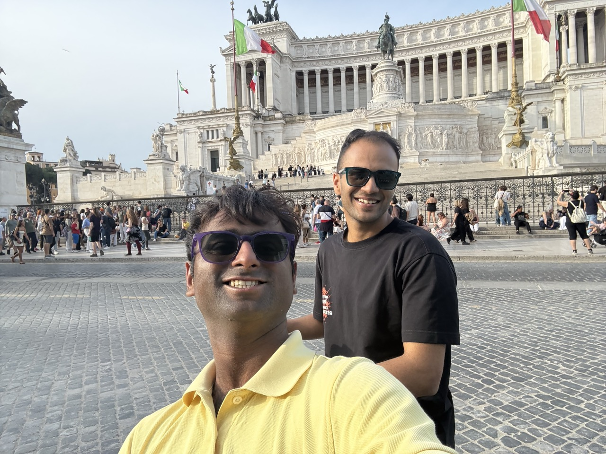

We also saw [Piazza Navona](https://share.google/td8ZmtRVyPOWXWlAS) and the [Otherwise Bookshop](https://maps.app.goo.gl/FytruCkj9UdYZeRC6) nearby. This bookshop had more personality than the bookshop I visited in Milan.

For the night, we stayed at [hu Roma](https://roma.huopenair.com/), about an hour outside the city. Getting there required taking the metro from Roma Termini to the Cornelia station and then a bus to the place, and the buses were quite infrequent especially later at night. The place itself is a bit of an _experience._ It's essentially a bunch of cabins and trailer camps that's been built into its own little mini city. Not bad if you're into that vibe, but our room shook a little when neighbors moved and was quite tiny. It was cheap enough considering Rome prices that I can’t complain much, but in hindsight I'd have paid a little more for something closer and better. There's a hotel right opposite it that isn't much pricier, I'd pick that instead. The key thing to keep in mind is to stay somewhere reachable directly via metro to avoid depending on the infrequent bus.

# Day 3: Vatican City and the Colosseum

Woke up super late, around 10am. Had a salad at hu Roma before leaving, it was bad. Much better would've been to just grab something at any random coffee shop on the way, which is what I'd recommend doing.

First stop was Vatican City. We should've booked tickets for St. Peter's Basilica in advance but didn't, so we could only see the area from outside. Still cool to see though. After that we had a Margherita pizza at [Hostaria Ago e Lillo](https://share.google/FDJNGRi1tQ2LmmTJy), it was a good Roman style pizza (not Neapolitan).

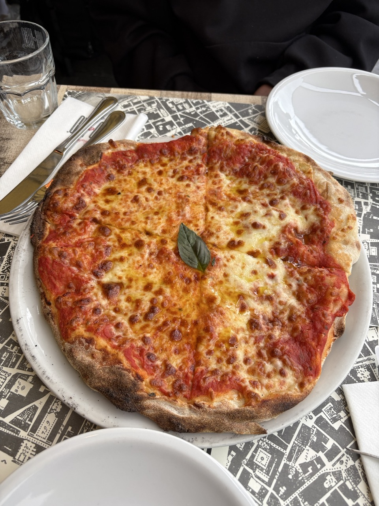

This was also where I was introduced to the concept of paying for "plates" which is essentially a fixed service charge of 2-3 euros per person regardless of what you order. So if three people come in and share one tiramisu, does this mean you end up paying more in plate charges than the tiramisu itself? If you try please let me know.

Walked back towards Rome passing by Castel Sant'Angelo. On the way I witnessed the bracelet scam my friends had warned me about, where someone offers you a bracelet for "free" initially and then later demands payment. Saw it happen to a family, but luckily things didn't turn too bad. The guy just took back the bracelets since the family had no cash on them, they only had bananas which he did take from them.

Also saw the Pantheon from outside before heading to the Colosseum for which we had tickets booked to enter at 5:30pm. We wanted to also do the Roman Forum and Palatine Hill on the same day as well but the last entry was 6:15pm so we couldn't make it. We did learn that our ticket stays valid until our entry time the next day though, so we decided to save those for the next day.

On the way back we passed by the Vittoriano again and noticed people standing on top of it. The view from up there looked like it would be incredible, so we added that to the next day's list too. Entering the inside is free but the terrace requires a separate ticket, which you can buy [online from their website](https://vive.midaticket.com/en/).

Tried to get dinner in Rome on a Sunday evening but the three places we tried all had 30+ minute waits, so we grabbed panini from Fuorinorma again. This time I had the "Tredici" with pumpkin sauce. It was good, but the one from the previous day was better. Then took the metro back to Cornelia and had dinner at [Fusioni](https://maps.app.goo.gl/vhqjE94J2k5AqMf89) near the bus stop. I asked them to make a Carbonara without meat, didn't love it. The pasta felt slightly undercooked, and the taste was a bit off, though that might just be Carbonara not being my thing. Luckily the bus stop was right outside and we managed to catch a bus immediately after dinner, which was a relief since the next one was 40 minutes later.

# Day 4: Roman Forum, Palatine Hill, and Vittoriano

We had our train to Naples at 4pm and a solid list of things to get through before that: Roman Forum, Palatine Hill, Vittoriano, and Trevi Fountain, so we left early around 10am (yes, that's early for us).

On the way, we stopped at [Pasticceria Tiramisù Roma](https://maps.app.goo.gl/4yAettR6C4H67skVA) for a sandwich and tiramisu. It was my first tiramisu in Italy and it did not disappoint at all.

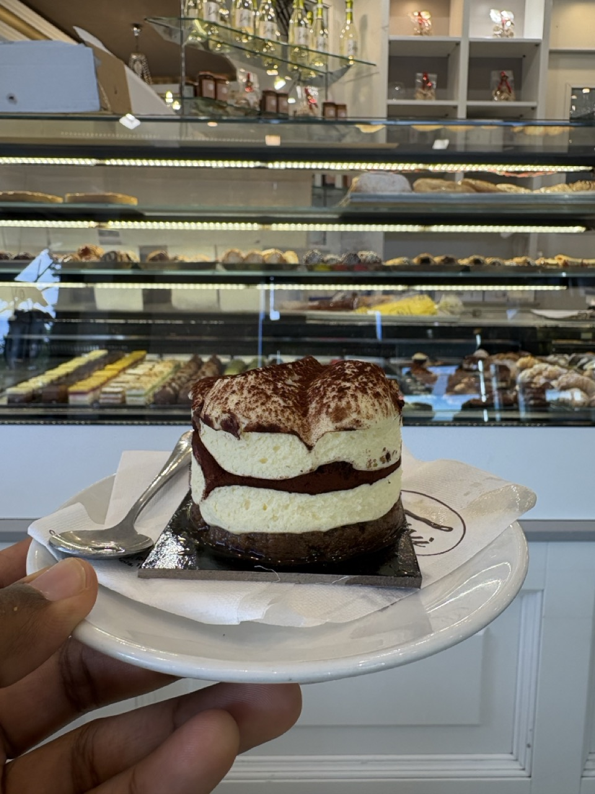

The Roman Forum was interesting but I'd recommend getting a guide if you're into the history, since there aren't many boards explaining what you're looking at. Palatine Hill was the highlight for me. Beautiful views from the top and a really pretty garden. I actually enjoyed it more than the Colosseum from the inside, and I'd say the combined ticket is worth it just for Palatine Hill alone.

From there we walked to the Vittoriano and took the lift to the top. Great views of Rome as a city, would definitely recommend doing this.

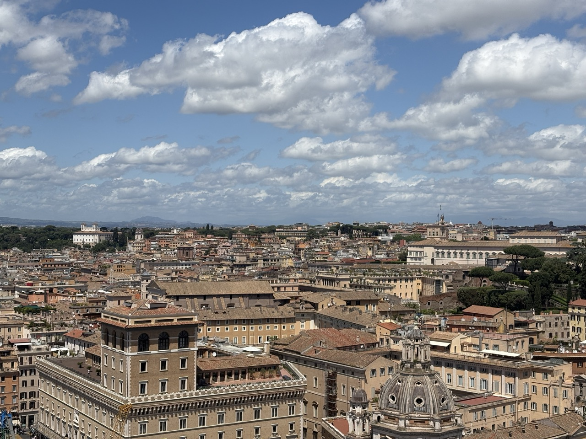

For lunch we had pizza at [Ristorante Plebiscito](https://maps.app.goo.gl/PZoAYPeobqRaL9Ra7). I had the four cheese, which was good, but if we’re comparing I’d say that I preferred the Margherita from the day before. I think I just like the tomato sauce more than just all cheese. Not a fault of the place at all.

We had wanted to see the Trevi Fountain but were running late for our train to Naples so had to skip it and head straight to Roma Termini. One stupid mistake on the train (Trenitalia), we forgot to fill our water bottles, and there was nothing being sold on board either. We did have water and snacks being sold on our Milan to Rome train (Italo) so we assumed we’d get it here as well.

Arrived in Naples in the evening and stepping out of Napoli Centrale was a completely different vibe to Rome. The area around the station felt crowded and a bit overwhelming. We walked to our hotel, [1811 Palace](https://www.residenzastorica.it/), which was in the same area. Initial impressions weren't great and it did feel slightly unsafe, but the hotel itself was nice and felt secure. The room was a bit tiny, but the host was polite and chatty. He gave us a list of recommendations which we mostly ignored since we had our own.

After settling in we headed to our first Naples pizza stop, [10 Diego Vitagliano Pizzeria](https://maps.app.goo.gl/F6Y6sKvyMo7Bq1nYA). Getting there was a bit of a pain since the bus Google Maps suggested never showed up, so we took the metro and walked the rest. The area near the restaurant was completely different to where we were staying. This was coastal, posh, and very pretty. Walked by Castel dell'Ovo and saw Mount Vesuvius on the way.

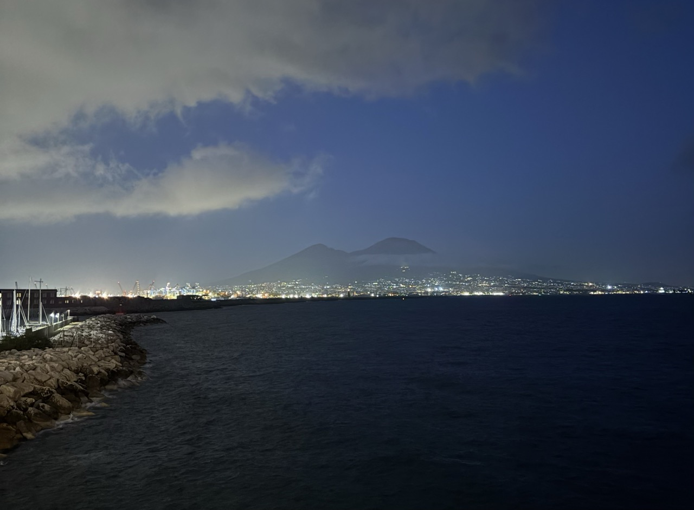

The pizza was really good, my first proper Neapolitan style. Also tried a drink called Galvanina Chinotto Bio for the first time. I still can't decide whether I liked it or not, but it was definitely _interesting_.

After dinner we decided to walk back since we couldn't find a bus. It was about 40 minutes but entirely along the coast and really beautiful. On the way we accidentally stumbled into [Piazza del Plebiscito](https://maps.app.goo.gl/cqfgGGz1JPyy7sUy6), where the [Estatua Ecuestre de Carlos de Borbón](https://maps.app.goo.gl/1iexKcdbgKRoqwSu8) was lit up beautifully in blue.

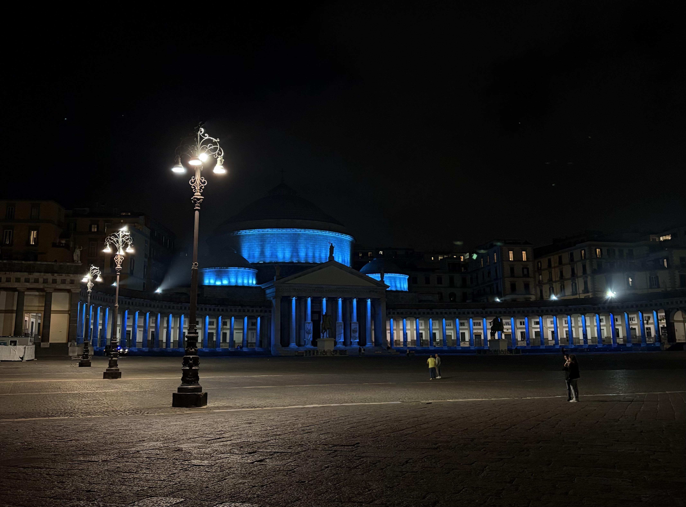

We also walked past what I think was the [Lega Navale Napoli](https://maps.app.goo.gl/ygqif3tZxPEWiBd76) building, lit up in the colors of the Italian flag. A nice end to a long day.

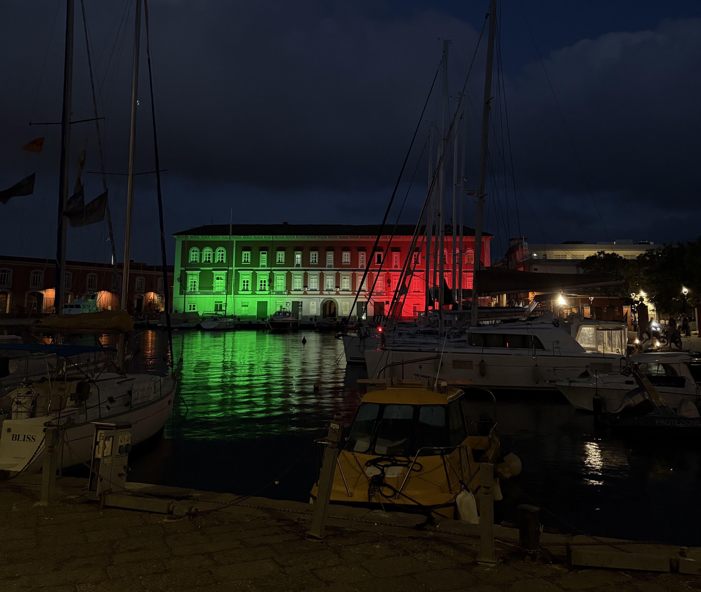

# Day 5: Scuba Diving at Baia

Woke up late to rest. We had booked a scuba dive with Subaia to see the underwater archaeological ruins at Baia, so we took the 101 bus from a stop near our hotel. Had breakfast at [Granato - Pasticceria & Caffetteria](https://maps.app.goo.gl/wxPbc8ggTewGKj7K6) right opposite the bus stop which was decent, nothing too spectacular but also not disappointing like that salad at hu Roma.

The drive to Subaia got increasingly scenic as we approached the dive shop. The dive experience itself was great, equipment was in good condition, the instructors were friendly and made me feel safe throughout. The dive isn't very intimidating in the first place since you only go to a max depth of around 5 meters. There isn't a lot of marine life to see, and they don't tell you beforehand which dive sites you'll visit. For our dives the chosen ones were "Terme of Lacus" and "Villa a Protiro", I liked the second one more. Here are two things we saw underwater (these images are from Subaia and not of our dive specifically)

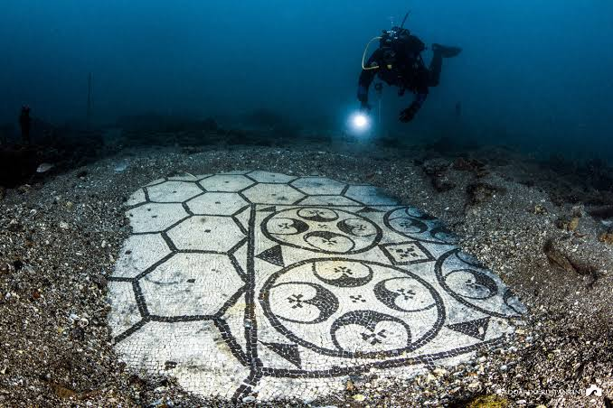

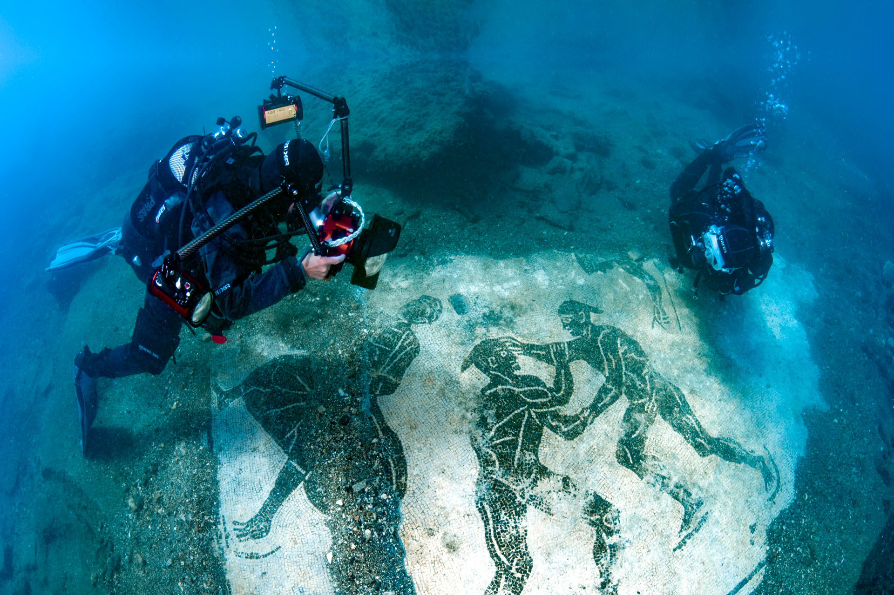

I don't remember much of the historical significance but the first looked like an angry penguin and the second was two people fighting with a referee standing next to them. The instructor also showed us a heating bath mechanism where he held the regulator under it and bubbles came through, showing it was still functional after all this time. Pretty cool. One thing I'd say is to book two dives instead of one since they felt quite short (35ish minutes each). The weather was also really sunny that day which felt perfect!

After the dive we walked around the area, which is really beautiful, and had gelato at [Colibrì Bar Gelateria](https://maps.app.goo.gl/JkEQfXDnATSyWgvV7), really yummy.

Then we took the bus to [50 Kalò](https://maps.app.goo.gl/YK327MHUKizCrK7s5) for pizza. I had the Nerano pizza and the tiramisu, both were AMAZING. The pizza was also bigger than the one from the previous night.

From there we walked back to the hotel, about an hour along the coast, and it was one of the most beautiful stretches I walked on the entire trip. If you're in Naples I'd really recommend doing this walk, especially around evening or night.

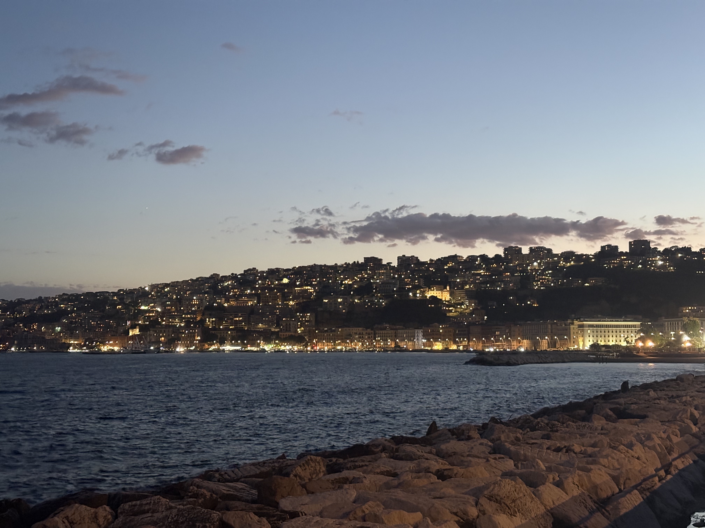

On the way we also spotted Hotel Excelsior, which was one of the filming locations for an episode of The Sopranos.

# Day 6: Amalfi Coast

This day we had our ferry from Naples to the Amalfi Coast (to Positano specifically). I got a bit late checking out of the hotel, so my friend went ahead to grab pizza from [L'Antica Pizzeria da Michele](https://maps.app.goo.gl/qNoZbZEgbkTbJswE7) which is a super famous pizza place in Napoli that was quite close to our hotel. Even though he got there right as it opened, a queue had already started forming. He brought the pizzas back and we had them in the hotel lobby after checkout. They were good, but nothing I'd personally queue up for.

The ferry ride itself was quite amazing, I'd recommend sitting on the top deck to soak in the views. I did feel a little seasick, which might have had something to do with having only pizza for breakfast.

For our stay on the Amalfi Coast we were in Praiano, and I'd definitely recommend this over Positano or Amalfi. Both Positano and Amalfi were noticeably more crowded and expensive. Praiano is easy enough to use as a base to visit both via bus, though more on the buses later.

One mistake we made was taking the ferry to Positano thinking it'd be closer to Praiano. There are a lot of steps to climb from the Positano port to the main road, which was really annoying with a large suitcase. Since you'll be taking a bus to Praiano regardless, it doesn't actually matter whether you start from Positano or Amalfi, and Amalfi at least spares you the excessive stair climb. Worth keeping in mind when booking your ferry.

Once we reached the main road we waited quite a while for the bus. Buses on the Amalfi Coast were the most unreliable we encountered on the entire trip. Often delayed, and sometimes so full they won't even stop so you have to wait for the next one. We waited about an hour, but honestly Amalfi is so pretty that we didn't mind just standing there taking it all in.

[The Airbnb in Praiano](https://www.airbnb.co.in/rooms/6074513) was really good and the view from the balcony was amazing, easy to recommend. Later that day we stopped by the tourist info centre to ask about the Path of Gods hike we were planning to do. The person there advised us to skip it if the weather stayed as it was (cloudy) but luckily things cleared up the next day.

For dinner we went to [Bar del Sole](https://maps.app.goo.gl/38HRNmGKZRtVDWnq5). The vegetarian spaghetti wasn't anything special, and neither was the gelato.

A quick note on buses in Amalfi since you'll be relying on them a lot: they're usually delayed by at least 10-15 minutes. SITA buses are the main ones and you can find their schedule at the tourist info desk. Google Maps also shows a more or less accurate timetable. Tickets can be bought at local shops or on the bus itself (though I'm not fully sure about the latter). There's no tap to pay by card. Honestly, if you want to get around to Amalfi and Positano comfortably, renting a Vespa is probably the best option.

# Day 7: Path of Gods Hike

It rained in the morning, but luckily cleared up quite soon and by around 1pm it was sunny. We knew the hike would take 3-4 hours and the forecast looked good for the rest of the day, so we decided to go for it.

Before heading out we had lunch at [Cafe Novanta Quattro](https://maps.app.goo.gl/2FLZ482QWvRqhrY18). Since I refused to have pizza as my first meal of the day again, I had bread and omelette which was nice. That followed by an ice cream at a shop nearby. Then we were ready.

Most places recommend starting the hike from Bomerano, and there is a route from Praiano too but it involves climbing about 1000 steps to reach the Path of Gods trail. Getting to Bomerano meant taking a bus from Praiano to Amalfi and then another from Amalfi to Bomerano, and figuring out those logistics felt harder to me than just climbing the steps. So we decided to start from Praiano itself. The steps were tough but if you work out regularly they weren't too bad, and I'd say just take them rather than deal with the bus connections.

To do this, first put “Convento di San Domenico” into Google Maps and follow the route until there. After that, search for "Path of Gods" and you'll see where it connects to the trail. From Convento di San Domenico there's a slightly narrow and broken path that leads to the main trail. Seeing it, I could understand why the person at the tourist info desk advised against it in rainy weather, since it could get very slippery. Once you're actually on the Path of Gods though, the path is wide and even has a railing on one side.

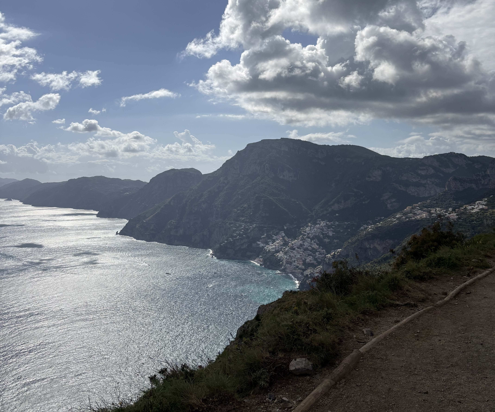

The views on the trail were absolutely breathtaking. You could see both Praiano and Positano from up top, which looked magnificent. If you're visiting the Amalfi Coast, I would really recommend doing this hike. After the trail ends there are still a bunch of steps down to Positano from Nocelle. In Positano I had some hot chocolate and a cookie before taking the bus back to Praiano, where we caught a beautiful sunset that evening.

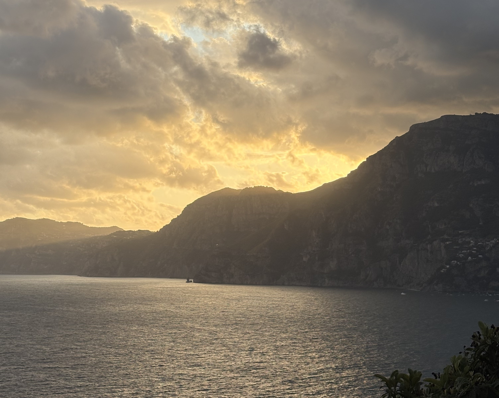

For dinner I got a Margherita takeaway from [Che Bontà](https://maps.app.goo.gl/cCkdHDYuMffxamdr7) and had it at the Airbnb. It was quite good. A nice, low-key end to what had been a pretty epic day.

# Day 8: Beach Day

Super exhausted from the hike, we woke up very late. We had decided to keep this day for the beach, and luckily the weather cooperated.

Had the same omelette and ice cream breakfast as the day before and started walking towards [Marina di Praia](https://maps.app.goo.gl/6EgawV8hRKncX7ub8), which we'd been told was the only sandy beach nearby. One mistake we made was following Google Maps instead of taking the main road, it routed us through a bunch of stairs. Take the road.

We reached the beach around 3pm, only to discover two things. First, it wasn't much of a sandy beach at all. Very little sand and mostly tiny rocks, more of a cove between cliffs than an actual beach. Second, the area and all the nearby restaurants were closed because a Netflix movie called "Positano" starring Matthew McConaughey and Zoe Saldana was being filmed there (no we didn’t get to see either of them).

There were still a few people around though, and after talking to the guard he let us hang out until 4pm along with everyone else who was already there. We swam a bit and sunbathed before being asked to leave. Not quite the beach day we had planned, but still a fun story.

Walked back to the AirBnb to shower, and afterwards we went to get bus tickets in advance for the next morning since we had a ferry from Amalfi at around 10am. Got them at the tourist office and learned the first bus leaves at around 7:20am. We decided to take that one just to be safe even though there were options for later.

For dinner we went to [Kasai](https://maps.app.goo.gl/y8QkiSg6omswimkW7). The ambience and food were both really good. I had the Spaghettoni with scarpariello sauce, probably the best meal I had on the entire Amalfi leg of the trip. And I would really, really recommend their tiramisu. It was amazing. It was also the most expensive dinner we had throughout the trip, but worth it.

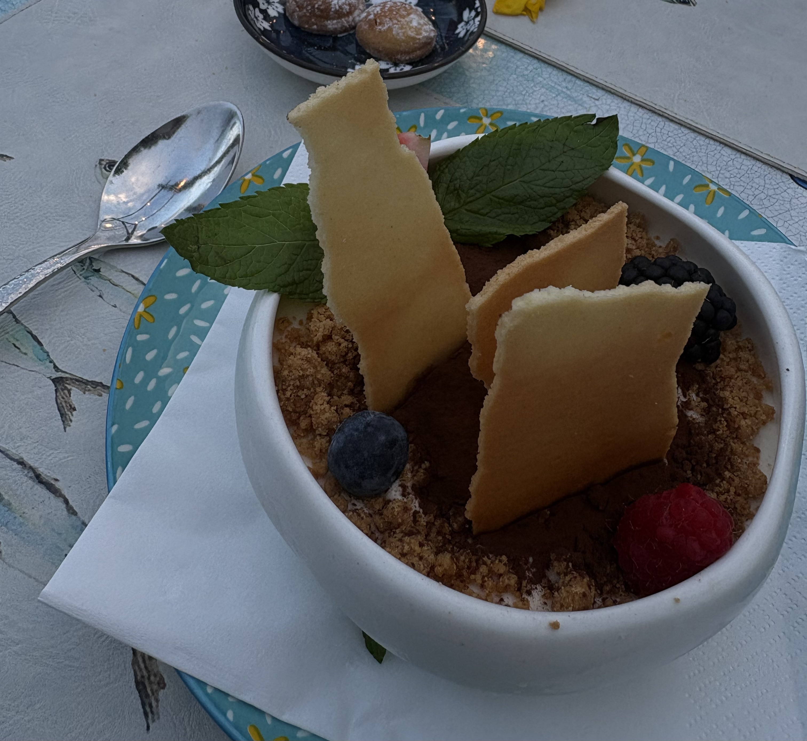

# Day 9: The Journey Back

Mostly a travel day. We took the 7:30am bus from Praiano to Amalfi, where we had a ferry booked with Travelmar. I'd really recommend not booking anything with them. Our ferry was cancelled and they didn't even bother informing us. Luckily since we'd arrived early we were checking their website and spotted it ourselves in time.

We decided to take the bus from Amalfi to Sorrento, where our train to Milan was departing from. While waiting in Amalfi I had a hot chocolate, an almond croissant, and picked up a chocolate to bring back from [Pasticceria Pansa Amalfi](https://maps.app.goo.gl/j2mFdaNSxYEWi9Th9). Everything was okayish, nothing too spectacular. Then it was trains back to Milan and the trip was done. Our flight was next day and we stayed at [this AirBnb](https://www.airbnb.co.in/rooms/5767805?guests=1&c=.pi129.pkpast_trip_share_virality&s=67&unique_share_id=35b0398c-6f01-40b7-951a-36188bcac180) in Milan. This was my second least favorite stay out of all the ones we were at (the least favorite one being the one in Rome). But just for one night before catching our flight, it was okay for the price we paid for it.

# Highlights

And now for the award ceremony:

- **Best day** was the scuba day in Baia. The weather, being underwater, the gelato afterwards, the tiramisu at 50 Kalò, and the walk along the Naples coast all came together perfectly.
- **Beauty wise**, the Amalfi Coast was unbeatable. Food wise, it ranked the lowest of everywhere we visited.
- **Rome** was the most happening and fun city, probably out of all the European cities I've visited. You could walk for 5-10 minutes in any direction and stumble into something incredible like the Colosseum, the Pantheon, the Vittoriano. The food was also really good.
- **Naples pizza** was good but I wouldn't go there just for it unless you're a die-hard pizza fanatic.
- **Best stay** was definitely the Praiano Airbnb.
- **Best gelato** was the one at Gelateria La Romana dal 1947 in Milan on the first day.
- **Best tiramisu** is genuinely too hard to pick, I can't decide.
- **Best pizza** was at 50 Kalò in Naples, but not by a huge margin.
