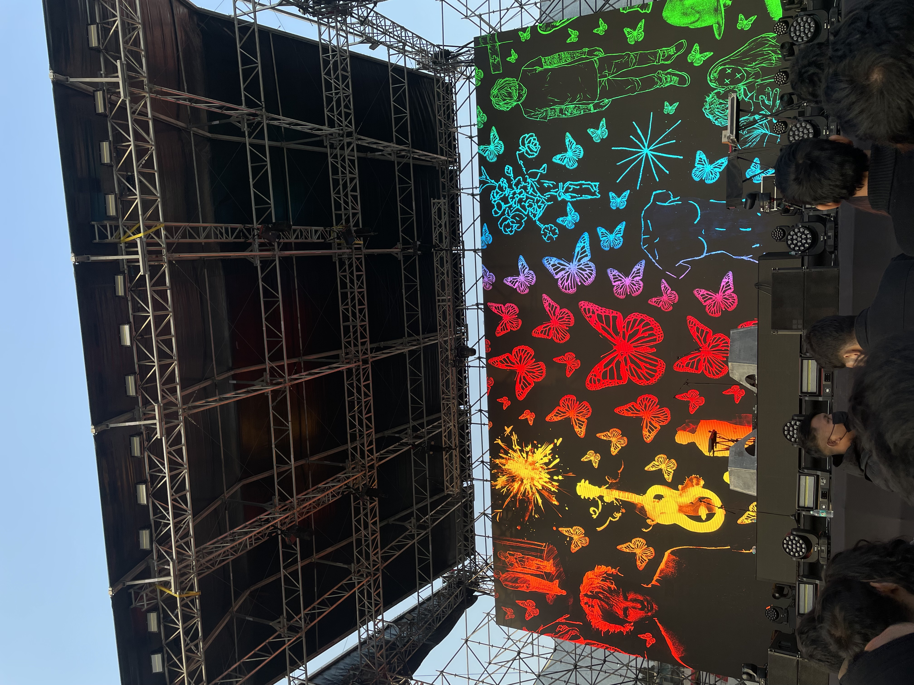
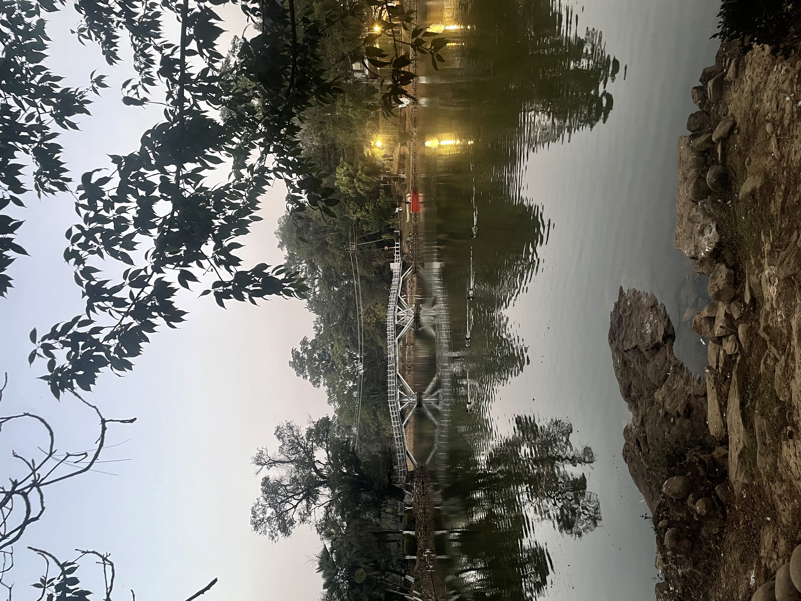

Documenting my 10-day trip to Meghalaya taken in the February of 2025. Ed Sheeran was going to be performing live in Shillong, and since I’d never been to the northeast, I thought this would be a good excuse to make a trip out of it. This blog is meant as a guide for other fellow travelers plus a way to document the trip for me so I can come back and read it sometime in the future :)

## Day 1: Arrival in Shillong

I landed at Guwahati Airport by 11 AM. Shared cabs to Shillong were asking for ₹1,000, but I managed to negotiate it down to ₹800. However, the driver wouldn’t drop me directly to [Zostel](https://www.zostel.com/zostel/shillong/) (my stay), so I ended up paying ₹1,000 anyway. Reached Zostel by 4 PM, relaxed, and had food at their canteen (would recommend!).

The evening was spent playing table tennis, meeting other people, most of whom were there for the concert, and exploring the city on foot. Walking uphill from Zostel gave a stunning view of the city at night, including the stadium where the Ed Sheeran concert was supposed to happen!

## Day 2: Dawki and Mawlynnong

In the morning, I met two other people at Zostel who were going to visit Dawki and Mawlynnong, both of which I really wanted to see.

Dawki is famous for its clear waters. When you get there, there’s a boat ride, and then they take you near a stream. The whole thing lasts about 40 mins.

Mawlynnong is supposed to be Asia’s cleanest village (debatable) but was more interesting than Dawki, I feel. You can roam around the village and see different benches, etc., which the villagers have made from local plants instead of metal, etc.

The cab cost us ₹3,700 for three people for the full day. While both places were scenic, they felt a bit like tourist traps, and the 3-hour journey each way didn’t feel worth it.

We also saw the single-decker living root bridge near Mawlynnong, which was cool but didn’t fascinate me as much as I expected. The local vegetarian food wasn’t that great either at the Mawlynnong village.

At night, there was a bonfire at the Zostel, which was my highlight for that day haha.

## Day 3: Concert Day

I shifted from Zostel to an Airbnb in Lachumiere ([The Anchorage](https://www.airbnb.co.in/rooms/29950483)). The place was decent but cost more than I’d planned since everything else was sold out because of the concert. Brunch at Dylan’s Cafe was fantastic—highly recommend it! 

The highlight of the day was obviously the Ed Sheeran concert, which was absolutely amazing. Later, I went back to Zostel and hung out with everyone by the bonfire till 3 AM.

## Day 4: Nongjrong Sunrise and Ward’s Lake

Left at 3 AM for Nongjrong to catch the sunrise. The views from the top were breathtaking and totally worth the early start. I would definitely recommend going here. We were a group of about 10 people, and the cab charged ₹3k for 4 people in a cab.

Came back by 9 AM, slept, and relaxed till 5 PM. In the evening, I visited Ward’s Lake and Police Bazar. The night market (doesn't happen always, please google) at Ward’s Lake was fun, especially the stall selling millet-based cookies and cheesecake—so delicious!

## Day 5: Cherrapunjee

Took a cab to Cherrapunjee for ₹1,800 (after some negotiation). Stayed at a cozy Airbnb called [Aiom Sohra](https://www.airbnb.co.in/rooms/1034661654544688044). Rented an Activa and visited Mawsmai Cave, which was interesting. Climbing the stairs near the cave entrance during sunset offered stunning views of the surrounding hills.

Also checked out the Seven Sisters Falls, though there was no water. For dinner, there isn’t much around, but I was grateful to get a home-cooked meal by the Airbnb’s house help.

## Day 6: Double Decker Root Bridge and Rainbow Falls

I left my Airbnb around 9 AM to reach Tyrna Village, the starting point for the trek to the Double Decker Root Bridge. It was a short 25-minute drive from where I was staying. A cab driver had earlier advised me that a guide wasn’t necessary since the trail is well-marked and easy to follow. So, I rented a trekking stick (highly recommend this!) and began the trek around 10 AM.

Before reaching the Double Decker Bridge, there’s a small swimming lagoon where I spent some time. They even rent out shorts if you don’t have your own. However, I’d suggest skipping this spot because there’s a much better lagoon further ahead. The Double Decker Bridge itself was interesting but not particularly breathtaking, and the trek to get there wasn’t too exhausting.

The real adventure began when I decided to continue to the Rainbow Falls, which is about an hour further along the trail. This part of the trek is where the exhaustion really kicks in! Along the way, you’ll pass the Blue Lagoon, which is a much better spot for a swim compared to the earlier one.

Reaching the Rainbow Falls was absolutely worth the effort. It’s one of the most beautiful sights I saw during the entire trip. I’d recommend avoiding looking at photos of it beforehand to fully appreciate the surprise and awe when you arrive.

I started heading back around 1:45 PM and reached the starting point by 4 PM. The last hour of the return trek is especially tiring, particularly if you’ve gone all the way to the Rainbow Falls. If you’re not up for the return journey in one day, there are plenty of homestays in the village where you can spend the night, though don’t expect any internet connectivity.

I made it back to my Airbnb by 5 PM and spent the rest of the evening resting and recovering from the trek.

## Day 7: Rest Day in Cherrapunjee

Today was supposed to be a rest day. I started my morning by reading and soaking in the sun. Later, I got some work done before heading out for lunch at a place called Darimi Kitchen. The food was pretty good! After lunch, I explored the area and stumbled upon some massive rocks overlooking the mountains. I sat there for a while, enjoying the view and relaxing. Once I returned, I spent the rest of the day working.

## Day 8: Maple Pine Homestay in Mawphlang

I traveled from Cherrapunjee to [Maple Pine](https://maplepine.culturalpursuits.com/what-we-are-2/) in Mawphlang. The cab ride cost ₹1500. I had booked this stay based on a Redditor’s recommendation, and while it was a unique experience, I think one less day here would have sufficed. The place really tests how comfortable you are with solitude since there’s nothing nearby except the Sacred Forest. Unless you rent a cab, you’re pretty much on your own, and there’s no Wi-Fi (though Jio works). My plan was to catch up on reading, and that’s exactly what I did. After arriving, I took a short walk nearby and then spent the rest of the day reading.

## Day 9: Sacred Forest and Village Exploration

The pancakes they serve for breakfast are absolutely delicious! After breakfast, I visited the Sacred Forest. I hired a guide to pick me up and drop me back for ₹200, though you can also walk there if you prefer. The Sacred Forest tour was fascinating and took about 40 minutes—I’d definitely recommend it. For lunch, I tried a local spot near the forest, and the food was decent. 

I considered hiking the David Scott Trail afterward but decided to explore the nearby village instead. I climbed a hill close by, which offered some stunning views. The rest of the day was spent reading and working.

## Day 10: Volunteering at Hill Mount School

Maple Pines’ website mentioned the option to volunteer at a local school, so I signed up for that today. I spent the morning from 9 AM to 1 PM at Hill Mount School, teaching and interacting with the kids. It was an incredibly fulfilling experience. Afterward, I returned to the lodge and got some work done. In the evening, I went for a short hike to the hill behind the property.

## Day 11: The Journey Back

This day turned out to be more adventurous than I had anticipated. I started with another round of those delicious pancakes for breakfast and left Maple Pines at 9 AM. 

I had negotiated a cab to drop me off in Shillong for ₹1,000, planning to take a shared taxi from there to the airport for another ₹1,000. The driver initially asked for ₹4,000 to take me directly to the airport, which seemed excessive. However, we got stuck in traffic for 1.5 hours before even reaching Shillong, and it didn’t look like it would clear anytime soon. The driver offered to take an alternate route for ₹4,500, and after some debate, I agreed, not wanting to risk missing my flight. Thankfully, I made it to the airport on time—only to find out my flight was delayed! Anyway, that was the final adventure of the trip.
