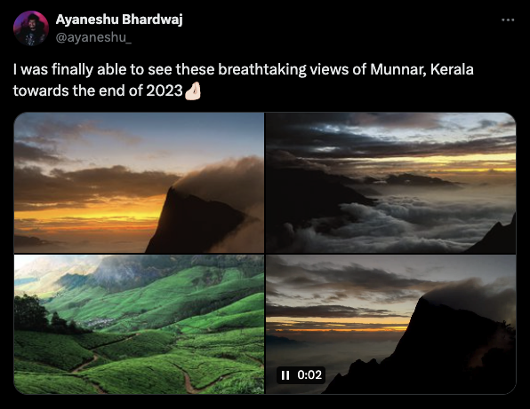
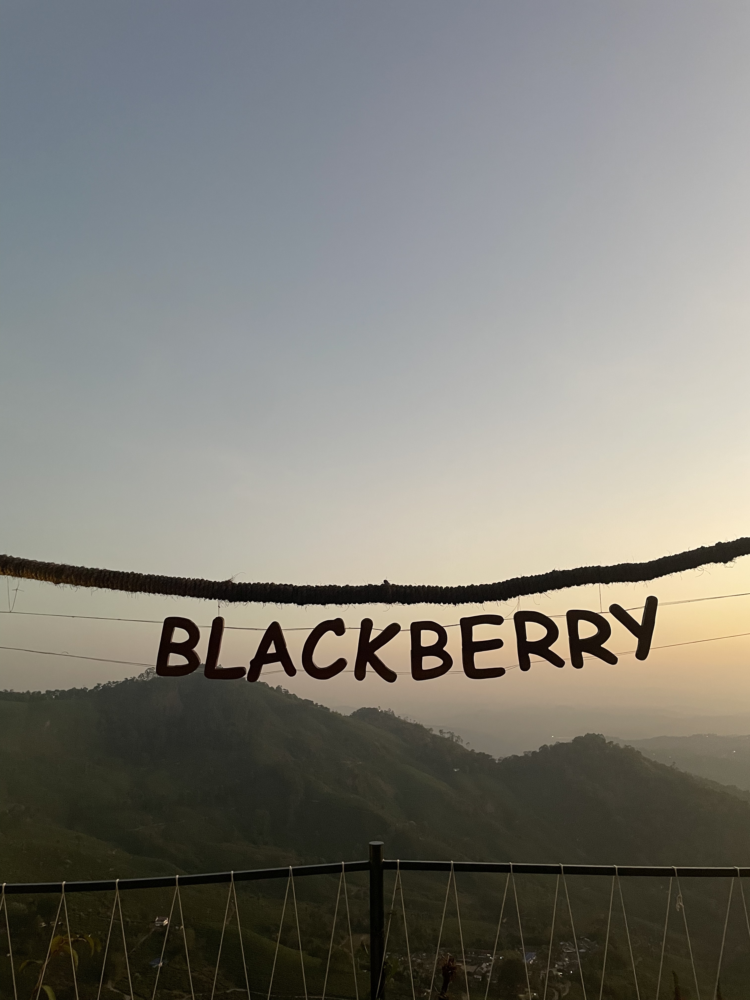
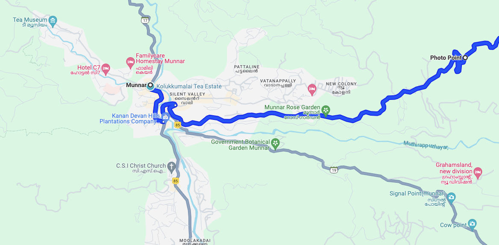
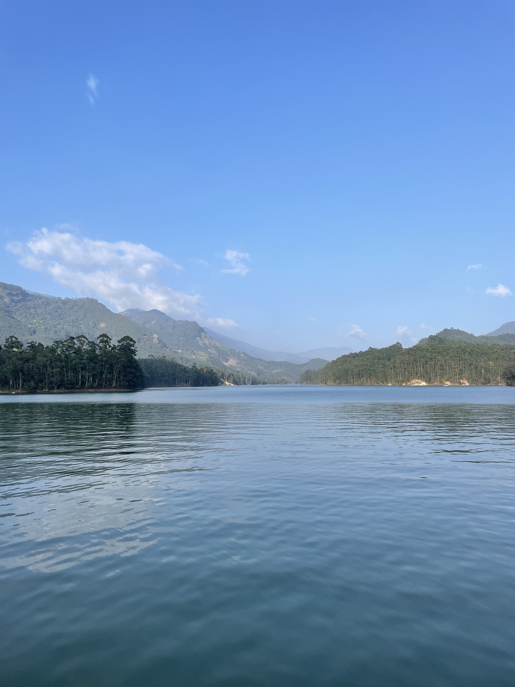
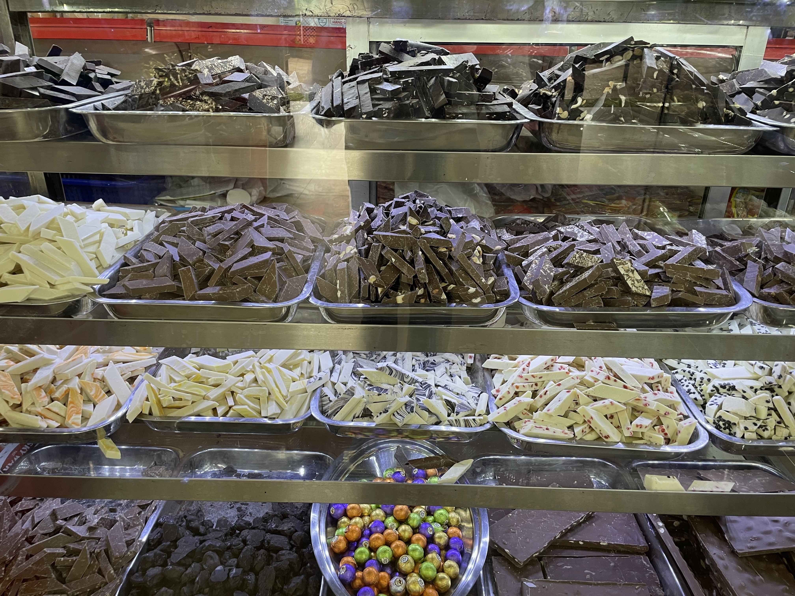
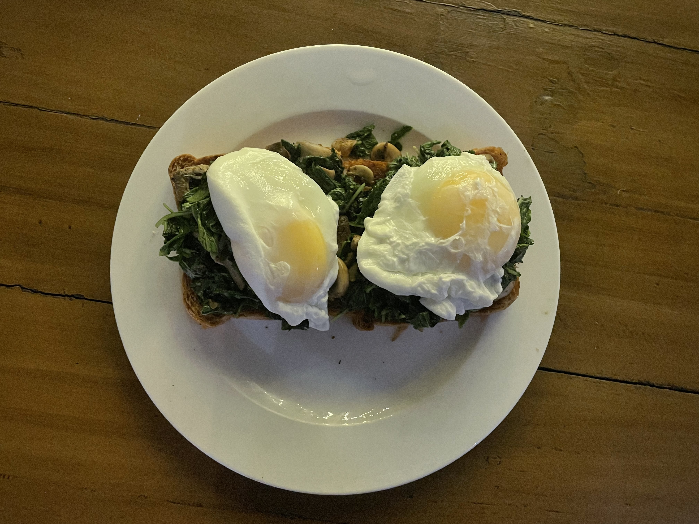
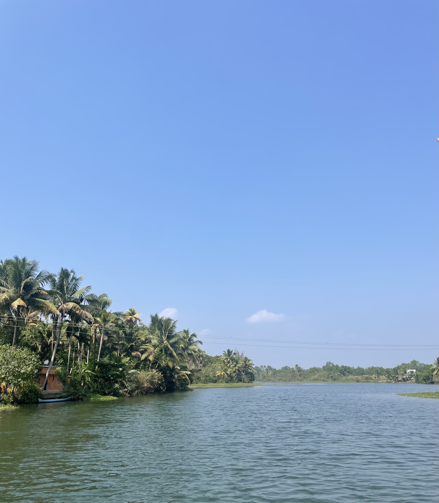

I had to travel to Ernakulam for some work earlier this month, and this was going to be my first time in Kerala. Coincidentally, around the same time, a tweet showing photos of Munnar popped up on my timeline.

I took that as a sign from the universe to extend my stay there and plan a workation around it. While I ultimately wasn't able to see the sunrise at Kollukumalai because I fell sick the night before I had plans to go (big bummer, I know), but I still had a lot of fun during my time there. This blog is about some of the things I enjoyed the most while in Kerala!

## Walking Around Munnar

Having lived in Chandigarh till now, I’ve had more trips to Himachal than I can count. And I thought Munnar would be just like the other hill stations I've seen, but it turned out to be so much more beautiful. The lush greenery from the tea plantations on the hills made it stand out. I stayed in Pothamedu and would definitely recommend that area if you're okay with a bit of walking or have your own vehicle. All the properties there are nestled amidst tea plantations, and the view is breathtakingly beautiful and green in the morning.

I would definitely recommend staying at the [Blackberry](https://blackberryresorts.com/) if you’re looking for a slightly fancier stay. While I didn’t stay there during my visit, I visited the property quite a few times for food and everything about it was just lovely!

Here's a photo of the delicious Thoran I had for lunch one day at Blackberry!

## Kayaking at Mattupetty Dam

If you look at the map of Munnar, there are four ways leading outward. Each one is packed with cool stuff to see and do.

I took the route to the Mattupetty Dam and Echo Point. While at Mattupetty, I spontaneously decided to try kayaking alone for the first time. I think this was one of the highlights of the trip for me. Mattupetty is absolutely beautiful! It turned out to be one of the highlights of my trip. The calm water for kayaking, surrounded by majestic mountains, is just indescribable - no photo I attach would do justice, but let me still try:

The kayaking experience was a bit scarier than I expected, but that's what made it fun! The boat was so close to the water, which added to the thrill. In a paddle boat, there’s still some height from the water surface, but this boat I was in was JUST SO close that it felt very scary! Definitely a must-do.

## Banana Chips and Chocolates!

Munnar is filled with small and big shops selling homemade chocolates. I won't lie, I was definitely considering leaving some clothes to make room in my bag for more of these to take home.

Same goes for banana chips (but you can find them in other places in Kerala as well). Out of all the ones I tried, my favorite chocolates were the white chocolates I got from the [Kannan Devan Tea Museum](https://kdhptea.com/service/tea-museum/) tour I did. The banana chips I liked the most were from this shop next to [Carmelgiri Restaurant](https://maps.app.goo.gl/Zhw2KhKviC25SiFt7). You could clearly taste and tell that they were made in coconut oil, which added so much to the taste, unlike the ones we get up north here! 😤

## Watching the Ships at Fort Kochi

The next time I'm in Kerala - and trust me, there will be a next time - I will definitely stay longer in Fort Kochi. I'll make sure to set aside a day or two to just chill by Fort Kochi port, watching the ships go by. There's something about these massive human creations that captures your complete attention and brings a sense of peace. Also, in general, around the evening time, that area comes alive, and it's just fun to be there and people-watch.

## Cafe Hopping in Fort Kochi

If you're into cute artsy cafes, then Fort Kochi is THE place to be! The entire area is filled with aesthetically pleasing cafes that serve well-presented and tasty food! Here are some of my top highlights:

* Hot chocolate at Loafers Corner
* Spinach Mushroom Toast with Poached Eggs at Qissa Café

  
* Hummus with Garlic bread (yes you read that right, it’s a good combo!) at Kashi Art Café
* And this last one isn’t a cafe but I would definitely recommend trying out Rasoi for Indian gravies and Kerala Parantha

## Backwater Boat Rides

I don’t think a trip to Kerala is complete without taking a boat ride through the beautiful backwaters. Initially, I planned to visit Alleppey, but the [homestay I stayed at](https://www.booking.com/Share-ibF7qy) in Fort Kochi (recommend if you're traveling solo!) suggested a half-day trip to Murinjapuzha for a backwater boat ride. I decided to change plans and go for it because it was convenient, and it turned out to be pretty fun too! :)

They also served us a traditional Kerala lunch (on a banana leaf and all that fancy stuff), and it was really good. I can't remember all that I had, but I do recall the feeling of wanting more 😋

## Thanks For Reading!

These were some of my things I enjoyed the most when I was in Kerala. I will definitely be going back whenever I get a chance next to see the sunrise from Kolukkumalai :P

I hope this helps you plan your trip to Kerala, and if you’d like to be notified whenever I post something, I’d recommend following me on [X](https://twitter.com/RinkiyaKeDad)!
